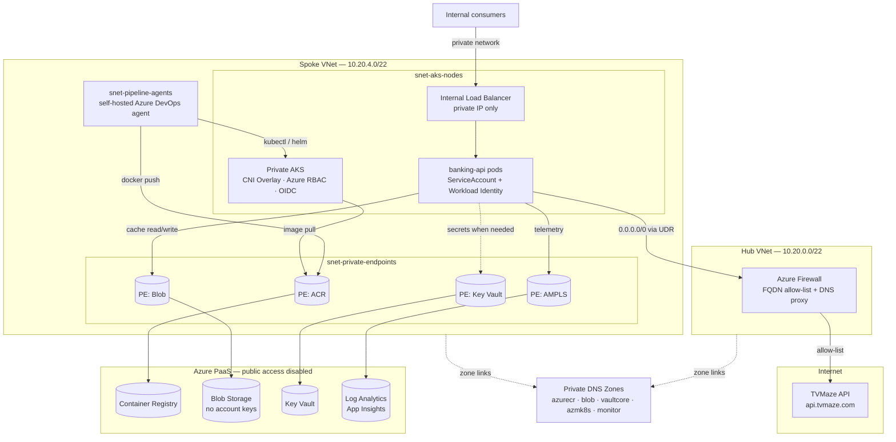

test
added from local
# Banking API Platform

An internal API platform for a banking organisation, built on a private AKS cluster.
The API exposes `GET /api/shows`, retrieves data from the external
[TVMaze API](https://www.tvmaze.com/api), caches responses in Azure Blob Storage,
and serves cached data to internal consumers.

The application is deliberately simple. Everything interesting is in the platform
around it: private networking, identity without secrets, reusable IaC, a gated
delivery pipeline and the operational tooling to run it.

---

## Architecture



---

## Prerequisites

| Requirement | Notes |
|---|---|
| Azure subscription | Contributor + User Access Administrator at subscription scope for the first apply (role assignments are created) |
| Terraform | 1.9.5 (pinned) |
| Azure CLI | 2.60+ with the `aks-preview` extension not required |
| kubelogin | Required — local accounts are disabled on the cluster |
| Helm | 3.16+ |
| Entra ID groups | Object IDs for cluster admins, cluster readers and Key Vault administrators |
| Self-hosted agent pool | VMSS agents with NICs in `snet-pipeline-agents`. **Microsoft-hosted agents cannot reach the private endpoints and will not work.** |
| Azure DevOps service connections | ARM connections using **Workload Identity Federation** — not secret-based service principals |

> Private ACR requires the **Premium** SKU. Free-tier subscriptions cannot deploy
> this platform as written.

---

## The CI/CD pipeline

```
Validate ──▶ Security ──▶ Build image ──┬─▶ Infra_Dev ──▶ Deploy_Dev ──┐
                                        │   (plan+apply)  (helm+smoke) │
                                        │                              ▼
                                        └────────────────────▶ Infra_Prod ──▶ Deploy_Prod
                                                              🔒 APPROVAL   🔒 APPROVAL
```

| Stage | What it does | Gate |
|---|---|---|
| **Validate** | `terraform fmt -check`, `terraform validate`, `tflint`, `helm lint`, `helm template` for both overlays, `kubeconform`, eslint | — |
| **Security** | Checkov (IaC), Trivy filesystem (dependencies), Gitleaks (committed secrets) | Fails on HIGH/CRITICAL |
| **Build image** | Docker build → **Trivy image scan** → push to private ACR via `az acr login` | Scan before push |
| **Infra_Dev** | `plan` → publish plan artifact → `apply` saved plan | Environment (no approver) |
| **Deploy_Dev** | Create telemetry Secret → `helm upgrade --install --atomic` → smoke tests | Auto-rollback on failure |
| **Infra_Prod** | Same template as non-prod | 🔒 **Approval required** |
| **Deploy_Prod** | Same template as non-prod | 🔒 **Approval required** |

## Assumptions and what was not validated

Stated plainly, because guessing at someone else's constraints is worse than
naming your own.

**Assumptions**

1. **Single subscription per environment**, with the hub in the same subscription
   as the spoke. A real landing zone would put the hub in a central connectivity
   subscription; the modules take resource group and VNet IDs as inputs, so this
   is a wiring change, not a redesign.
2. **Consumers are already on the private network** (peered spoke, ExpressRoute
   or VPN). The internal load balancer has no public address, and no ingress
   controller is deployed because nothing terminates public TLS.
3. **Entra group object IDs are supplied externally.** The code creates no
   groups — group lifecycle belongs to identity governance, not to a workload
   repository.
4. **The self-hosted agent pool exists before the first pipeline run.** Its
   subnet is created by Terraform, but the VMSS and the Azure DevOps pool
   registration are treated as platform prerequisites.
5. **Query access to Log Analytics remains public** while ingestion is private
   (`allow_public_log_query = true`). Fully private query blocks portal access
   from an engineer's laptop; the switch is one variable if that is acceptable.
6. **`kubernetes_policy_effect` is `Audit` in non-prod and `Deny` in prod.** Promoting
   straight to Deny on a live cluster can block system pods, so non-prod proves the
   rules first.

---
