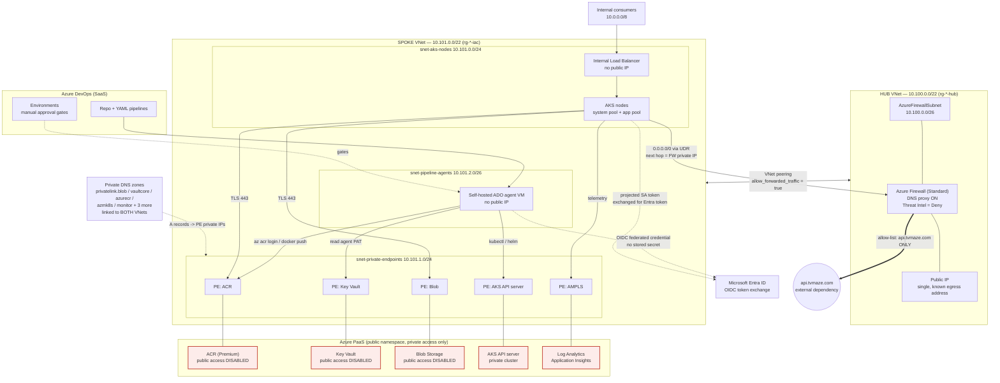
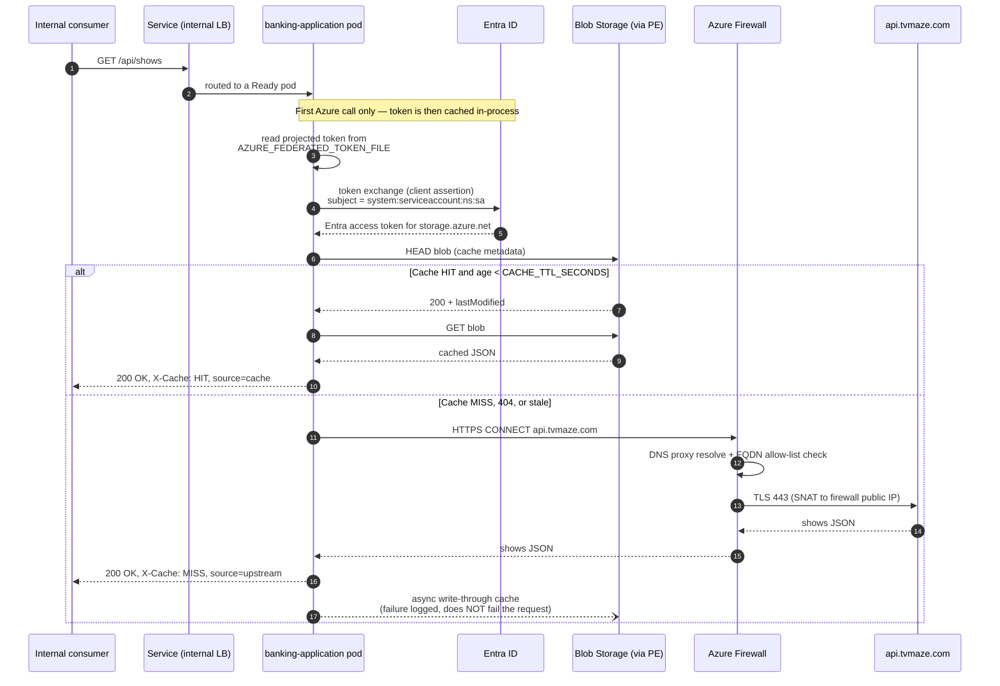
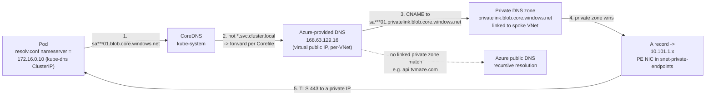
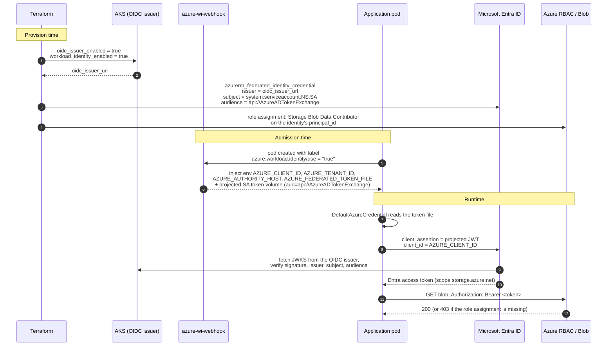
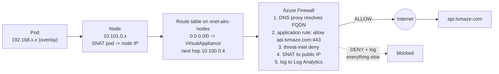
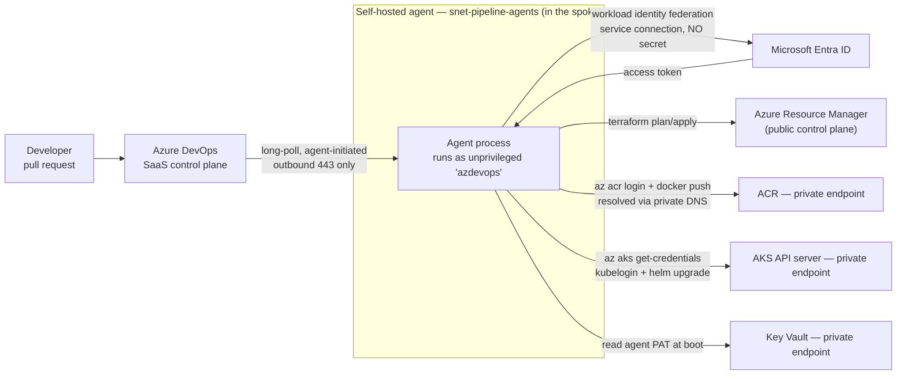
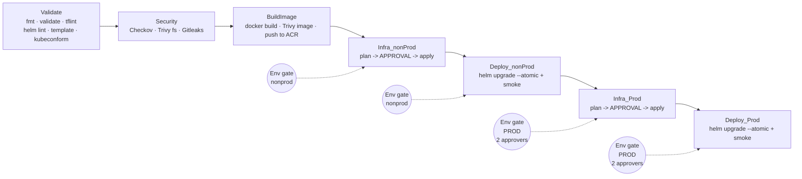

# 01 — End-to-End Architecture

> This is your **whiteboard script**. Every diagram here is one you should be able to draw from memory
> in under three minutes, and every arrow is one you should be able to justify.
>
> The golden rule for the interview: **narrate the flow, not the resource list.** The assessment says
> explicitly it wants *"a coherent end-to-end architecture rather than isolated Azure resources."*
> Never answer "what did you build?" with a list of Azure services. Answer it with a journey.

---

## 0. The 90-second opening statement

Memorise the shape of this. It is what you say when they ask "walk me through your architecture."

> "It's a hub-and-spoke platform with three hard boundaries.
>
> **Boundary one — inbound.** There is no public inbound path anywhere. The AKS API server is private,
> the application is exposed only on an internal load balancer, and ACR, Key Vault, Storage and Azure
> Monitor all have `public_network_access_enabled = false` with private endpoints.
>
> **Boundary two — outbound.** The AKS node subnet has a UDR sending `0.0.0.0/0` to Azure Firewall in
> the hub, and AKS itself is configured with `outbound_type = userDefinedRouting`, so there is no
> Azure-managed default outbound path at all. The firewall allows exactly one application FQDN —
> `api.tvmaze.com` — plus the AKS platform FQDN tag. Everything else is denied, logged, and alerted on.
>
> **Boundary three — identity.** Nothing in the workload holds a credential. The pod authenticates to
> Blob Storage using Entra Workload ID: a projected OIDC token is exchanged for an Entra token through
> a federated identity credential on a user-assigned managed identity. There is no storage key, no
> connection string and no client secret in the container, the chart or the pipeline.
>
> Delivery matches those boundaries: a self-hosted Azure DevOps agent lives *inside* the spoke, because
> Microsoft-hosted agents cannot reach a private endpoint. It authenticates to Azure with workload
> identity federation on the service connection — no stored secret — and deploys with
> `helm upgrade --install --atomic`, which gives me an automatic rollback on failure."

Then stop and let them pick a thread. **Do not narrate all six diagrams unprompted.**

---

## 1. Component inventory — what exists and where it lives in the repo

| Layer | What is deployed | Repo location |
|---|---|---|
| **Hub VNet** | Azure Firewall + policy, public IP (single egress address), `AzureFirewallSubnet` | [`modules/network-hub`](../infra/terraform/modules/network-hub) |
| **Spoke VNet** | AKS node subnet, private-endpoint subnet, pipeline-agent subnet, NSGs, route tables, bidirectional peering to hub | [`modules/network-spoke`](../infra/terraform/modules/network-spoke) |
| **AKS** | Private cluster, Azure CNI **Overlay**, Entra integration + Azure RBAC, OIDC issuer, Workload Identity, system + user node pools, Calico | [`modules/aks`](../infra/terraform/modules/aks) |
| **ACR** | **Premium** SKU (mandatory for Private Link), `public_network_access_enabled = false`, `admin_enabled = false` | [`modules/container-registry`](../infra/terraform/modules/container-registry) |
| **Storage** | Blob Storage for the TVMaze response cache, public access disabled, versioning + soft delete | [`modules/storage-account`](../infra/terraform/modules/storage-account) |
| **Key Vault** | RBAC-authorised (not access policies), purge protection, public access disabled | [`modules/key-vault`](../infra/terraform/modules/key-vault) |
| **Private DNS** | One zone per Private Link service, linked to hub **and** spoke VNets | [`modules/private-dns`](../infra/terraform/modules/private-dns) |
| **Workload identity** | User-assigned managed identity + federated identity credential bound to the app's Kubernetes ServiceAccount | [`modules/identity`](../infra/terraform/modules/identity) |
| **Pipeline agent** | Linux VM on `snet-pipeline-agents`, **no public IP**, CI toolchain pre-installed, Entra SSH login | [`modules/pipeline-agent`](../infra/terraform/modules/pipeline-agent) |
| **Observability** | Log Analytics, Application Insights, AMPLS + private endpoint, action group, metric alert | [`modules/observability`](../infra/terraform/modules/observability) |
| **Governance** | Azure Policy assignments: allowed locations, required tags, deny public access, AKS hardening | [`modules/governance`](../infra/terraform/modules/governance) |
| **Application** | Helm chart: SA + Workload ID annotations, probes, HPA, PDB, NetworkPolicy, per-env values | [`charts/banking-application`](../charts/banking-application) |
| **CI/CD** | Multi-stage Azure DevOps YAML on the private self-hosted pool | [`pipelines`](../pipelines) |

---

## 2. The whole platform, one diagram

### The five things to point at on this diagram

1. **The red boxes have no public network path at all.** Not "firewalled" — *disabled at the resource
   level*, then reachable only through the private endpoints in the middle.
2. **There is exactly one arrow leaving the platform to the internet**, and it goes through the firewall
   with an FQDN allow-list.
3. **The DNS zones are linked to both VNets.** That is what makes the agent *and* the pods resolve
   private IPs. Link only the spoke and your agent breaks; link only the hub and your pods break.
4. **The agent is inside the spoke.** This is the assessment's explicit "pipeline networking
   requirement" and the answer to Scenario 4.
5. **The dotted Entra arrows carry no secret.** They are OIDC token exchanges.

---

## 3. Request flow — `GET /api/shows`

### The design decisions embedded in this flow

| Decision | Why | The trade-off you accepted |
|---|---|---|
| **Read-through / write-through cache in Blob** | Simple, durable, shared across all replicas without a separate cache tier | Blob is ~10–50 ms per read vs ~1 ms for Redis. Fine for a 1-hour TTL; wrong for a hot path |
| **Cache write is asynchronous and non-fatal** | A Storage blip must degrade the cache, not the API | Two concurrent misses both fetch upstream and both write — last writer wins. Acceptable for idempotent read-only data |
| **TTL via blob `lastModified`, not a metadata field** | No extra write, no clock skew between app and storage | Coarser control; you can't set per-entry TTLs |
| **`X-Cache` response header** | Makes cache behaviour observable from outside the pod — the smoke test asserts on it | Leaks a little internal detail. Strip it at an external edge if there ever is one |
| **Liveness never touches Blob** | A Storage outage must not make Kubernetes kill every healthy pod and turn a partial outage into a total one | A pod that is alive but permanently unable to reach Storage stays running (readiness removes it from the Service, which is the correct behaviour) |
| **Readiness *does* touch Blob** | A pod with broken Workload Identity is pulled out of the endpoint list instead of serving errors | If Storage has a global outage, every pod goes NotReady at once and the Service has no endpoints. Mitigation: readiness should tolerate N consecutive failures, and consider serving stale cache instead |

> **The liveness-vs-readiness distinction is the single most common Kubernetes interview question.**
> Have this exact answer ready: *"Liveness answers 'should Kubernetes restart this process?' Readiness
> answers 'should this pod receive traffic?' A dependency failure is never a reason to restart — it's a
> reason to stop routing. Putting a dependency check in a liveness probe is how you turn a downstream
> blip into a cluster-wide crashloop."*

---

## 4. DNS resolution path — pod to private endpoint

This is the assessment's Part 3 bullet, verbatim: *"Explain the DNS path from pod → CoreDNS →
VNet/Azure DNS → Private DNS zone → Private Endpoint."*

### Narrate it in these exact steps

1. **Pod → CoreDNS.** The pod's `/etc/resolv.conf` points at the `kube-dns` ClusterIP —
   `172.16.0.10` in this design (`dns_service_ip`, which **must** sit inside `service_cidr`
   `172.16.0.0/16`; AKS validates this).
2. **CoreDNS decides.** Names matching the cluster domain (`*.svc.cluster.local`) are answered from the
   cluster. Everything else hits the `forward . /etc/resolv.conf` plugin in the Corefile, which
   forwards to the node's resolver — **`168.63.129.16`**, Azure's per-VNet DNS virtual IP. It is not
   routable, not an internet address, and is reachable from every VNet by definition.
3. **Azure DNS applies the Private Link CNAME.** Azure's *public* record for
   `sa***01.blob.core.windows.net` is a **CNAME to `sa***01.privatelink.blob.core.windows.net`**. This
   is the crucial mechanic that people get wrong: **the app never asks for the `privatelink` name.** It
   asks for the normal name and Azure redirects it.
4. **The linked private zone answers.** Because `privatelink.blob.core.windows.net` is linked to this
   VNet, Azure DNS resolves the CNAME target from the **private** zone and returns the A record created
   by the private endpoint's `private_dns_zone_group` → `10.101.1.x`. Without the link, resolution falls
   through to public DNS and returns the **public** storage IP — which then fails to connect, because
   `public_network_access_enabled = false`. That is Scenario 2.
5. **The pod connects to a private IP.** TLS still validates against `sa***01.blob.core.windows.net`,
   because the certificate is issued for the public name — which is exactly why the CNAME indirection
   exists rather than a rewritten hostname.

### The two DNS design choices worth defending

**Why no Azure DNS Private Resolver?** Because both VNets that need resolution — hub and spoke — are
directly linked to every private zone, and AKS uses the default Azure-provided DNS on the VNet. A
resolver is needed when you have **on-premises** clients that must resolve Azure private names (they
can't reach `168.63.129.16` over ExpressRoute/VPN), or when you have a **custom DNS server** that needs
a conditional forwarder target. Neither is true here.

> **Say this:** *"I'd add a DNS Private Resolver the moment on-prem needs to resolve these names, or the
> moment there's a corporate DNS estate. It's the standard hub component for that. Here it would be
> cost and a component with no job."*

**Why is the firewall's DNS proxy enabled if pods use Azure DNS?** Because **FQDN-based network rules on
Azure Firewall require the DNS proxy.** The firewall must resolve `api.tvmaze.com` itself and see the
same answer the client saw, otherwise a client could resolve the name to one IP and connect to another
(DNS rebinding). Application rules use SNI/Host inspection and are less dependent on it, but enabling
the proxy makes both rule types reliable — **and it gives you DNS query logs on the firewall**, which is
your only DNS telemetry in this design.

---

## 5. Identity and token flow — Workload Identity end to end

### The five things that must line up, or nothing works

| # | Must match | Where it lives in your repo | Failure symptom if wrong |
|---|---|---|---|
| 1 | `oidc_issuer_enabled = true` | `modules/aks/main.tf` | No token file is issued at all |
| 2 | `workload_identity_enabled = true` | `modules/aks/main.tf` | The webhook never injects anything |
| 3 | Pod **label** `azure.workload.identity/use: "true"` | `templates/deployment.yaml` (pod template labels — **not** the Deployment labels) | Env vars and token volume are missing → SDK silently falls back down the credential chain and eventually fails |
| 4 | SA **annotation** `azure.workload.identity/client-id` | `templates/serviceaccount.yaml` | Wrong or missing client ID → `AADSTS700016 Application not found` |
| 5 | FIC **subject** == `system:serviceaccount:<ns>:<sa>` | `modules/identity/main.tf` vs the Helm release namespace + SA name | **`AADSTS70021: No matching federated identity record`** ← see finding P0-6 |

Plus the one that is not about federation at all: **the Azure RBAC role assignment on the identity.**
Federation gets you *authenticated*; RBAC gets you *authorised*. Missing role → `403
AuthorizationPermissionMismatch`. **This distinction is the entire content of Troubleshooting
Scenario 1.**

> **Key sentence to have ready:** *"Workload Identity replaces a secret with a trust relationship. The
> cluster becomes an OIDC identity provider, Entra trusts that issuer for one exact subject, and the
> only thing in the pod is a short-lived, audience-scoped JWT that the kubelet rotates. If someone
> exfiltrates that token they have at most an hour, only for one audience, and only from a pod running
> under that exact ServiceAccount name in that exact namespace."*

---

## 6. Egress path — how a private workload reaches TVMaze

The assessment calls this out specifically: *"private does not mean isolated from the Internet."*

### Firewall vs NAT Gateway — the trade-off they will ask about

The assessment explicitly offers both options and asks you to justify your choice.

| | **Azure Firewall (chosen)** | **NAT Gateway** |
|---|---|---|
| Egress filtering | **FQDN + protocol + port allow-list**, threat intelligence, optional IDPS/TLS inspection (Premium) | **None.** Any destination, any port |
| Logging | Full L3/L7 flow logs + DNS proxy query logs into Log Analytics | Basic metrics only; no per-destination visibility |
| SNAT ports | 2,496 per public IP, scales with IP count | **64,512 per IP** — far better SNAT exhaustion headroom |
| Cost (West Europe, indicative) | ~$950/month + data processing | ~$35/month + data |
| Latency / SPOF | An extra hop; a stateful appliance in the path | Effectively transparent, fully managed, no rules to break |
| Compliance story | An auditable, enforced egress control | "We can't say where our data went" |

**The answer to give:**

> "I chose Azure Firewall, and the deciding factor is **data exfiltration control**, not connectivity.
> A NAT Gateway solves outbound *connectivity* and solves SNAT port exhaustion better than a firewall
> does. But it applies no policy. In a bank, a compromised container or a malicious dependency with an
> open NAT Gateway can post customer data to any host on the internet and I would have no log of it and
> no way to stop it. With the firewall, the only destination that resolves and connects is
> `api.tvmaze.com`; everything else is denied and logged, and 'denied egress attempt' becomes a
> detection signal.
>
> The costs are real: about $950 a month, an extra network hop, a stateful appliance that becomes a
> shared failure domain, and much tighter SNAT limits. If SNAT exhaustion became the binding constraint
> I'd put a **NAT Gateway behind the firewall on the AzureFirewallSubnet** — that's a supported pattern
> and gives you the firewall's policy with the NAT Gateway's port scale. For a genuinely
> throughput-heavy, low-sensitivity workload I'd flip to NAT Gateway plus strict NSG service tags and
> accept the reduced visibility."

**Failure handling to mention:** if the firewall is unavailable, the UDR next hop is unreachable and all
outbound fails — the app then serves **stale cache** rather than erroring, because the cache read path
doesn't traverse the firewall. That is a deliberate graceful-degradation property of putting the cache
on the private-endpoint side of the boundary. Say this; it shows you thought about the failure mode
rather than just the happy path.

Also mention: Azure Firewall is **zone-redundant** here (`zones = ["1","2","3"]`), so a single-zone
failure does not take egress down. And `threat_intelligence_mode = "Deny"` blocks known-malicious
IPs/domains from Microsoft's feed — cheap, high-value, and worth naming.

---

## 7. CI/CD path — how a commit reaches a private cluster

### The three questions the assessment asks about this path

**1. Agent placement.** A Linux VM with **no public IP** on `snet-pipeline-agents` (10.101.2.0/26) in
the spoke, peered to the hub. It is in the same VNet as the private endpoints, so the private DNS zones
linked to that VNet resolve for it. **Microsoft-hosted agents cannot work here** — they run in
Microsoft's network with no route to `10.101.1.x`, and no link to your private DNS zones, so
`acrnonprod.azurecr.io` would resolve to a public IP that then refuses the connection. The agent's
connection to Azure DevOps is **agent-initiated outbound long-polling on 443**, so no inbound firewall
rule and no public listener is ever required.

**2. DNS resolution.** The VM uses the VNet's default DNS (`168.63.129.16`). Every `privatelink.*` zone
is linked to **both** the hub and the spoke VNet by `modules/private-dns`, so the agent resolves
`*.azurecr.io`, `*.vault.azure.net` and the AKS `privatelink.<region>.azmk8s.io` name to private IPs —
by the identical mechanism the pods use. **This is why the module links every zone to both VNets rather
than just the spoke.**

**3. Identity.** Two distinct identities, and keeping them distinct is the point:

| Identity | What it is | What it can do | Where it's configured |
|---|---|---|---|
| **Service connection** (workload identity federation) | An Entra app federated to the ADO org — **no client secret** | `AcrPush` on ACR, **AKS RBAC Writer** + Cluster User on the cluster, and the ARM permissions needed for `terraform apply` | `var.pipeline_principal_ids` → `modules/aks`, `modules/container-registry`, `modules/key-vault` |
| **Agent VM managed identity** | A user-assigned MI on the VM | **Only** `Key Vault Secrets User`, to read its own registration PAT at boot | `modules/pipeline-agent/main.tf` |

> **The point to make:** *"The VM's identity can read one secret. It cannot deploy anything. The
> deployment identity is the service connection, which is federated — there is no secret to steal from
> the VM at all. If someone compromises the agent host, they get a PAT scoped to agent pools, not a
> path into my subscription."*
>
> And the honest follow-up: *"Except they'd also get whatever the running job's OIDC token grants,
> for its lifetime. That's why I'd move to ephemeral, per-job agents — see the DevSecOps doc."*

---

## 8. Promotion flow

**What's strong here, and worth saying:**

- **Plan and apply are separate jobs, and apply consumes the saved plan file** rather than re-planning.
  That closes the time-of-check-to-time-of-use gap: what the approver read is exactly what runs.
- `-detailed-exitcode` means "no changes" (exit 0) skips the apply cleanly instead of running a no-op.
- Prod cannot be reached without non-prod succeeding first, *and* an ADO Environment approval.
- Security scanning happens **before** anything is built or deployed — shift-left in the real sense.

**What's weak, and to acknowledge before they say it** (details in [02](02-code-review-findings.md)):

- The image is built once and pushed only to the non-prod registry, so the prod deploy references an
  image that does not exist there (P1-6).
- Deployment is by mutable tag rather than immutable digest.
- Prod approval gates are configured in Azure DevOps, not in the repo, so they are invisible to a
  reviewer — **document them in the README**.

---

## 9. Address plan and why each choice was made

| Range | Purpose | Reasoning |
|---|---|---|
| `10.100.0.0/22` | Hub VNet (nonprod) / `10.200.0.0/22` prod | Non-overlapping per environment so both could peer to a shared connectivity hub or on-prem later without renumbering |
| `10.100.0.0/26` | `AzureFirewallSubnet` | `/26` is Azure's **minimum** for Azure Firewall; the name is mandatory and case-sensitive |
| `10.101.0.0/24` | `snet-aks-nodes` | 251 usable. **With CNI Overlay only nodes and internal LB IPs consume VNet addresses**, not pods — so a /24 supports the whole cluster comfortably |
| `10.101.1.0/24` | `snet-private-endpoints` | One IP per private endpoint. Generous, but PE growth is the thing that surprises people |
| `10.101.2.0/26` | `snet-pipeline-agents` | Small and deliberately separate, so the PE NSG can allow the agent subnet explicitly and audit it |
| `192.168.0.0/16` | Pod CIDR (overlay) | **Not routable in the VNet** — it exists only inside the cluster. Must not overlap VNet space or on-prem |
| `172.16.0.0/16` | Service CIDR | ClusterIP range; also cluster-internal only |
| `172.16.0.10` | `dns_service_ip` | Must be inside `service_cidr`. AKS validates this at create time |

### Why Azure CNI Overlay — the headline networking decision

| Mode | VNet IPs consumed | Notes |
|---|---|---|
| **Kubenet** | Nodes only | Legacy, being retired, UDR-based pod routing, no Windows/network-policy parity |
| **Azure CNI (traditional)** | **Nodes + every pod** — you must pre-allocate `max_pods × nodes` VNet IPs | A 50-node cluster at 50 pods/node needs **2,500 IPs** ≈ a /21 per cluster. In a bank with a governed, scarce RFC1918 allocation this is the constraint that kills you |
| **Azure CNI Overlay (chosen)** | **Nodes only**; pods get overlay IPs from a private CIDR | Full Azure CNI feature set, Calico/Cilium network policy, but **pods are not directly addressable from the VNet** |

> **Say it like this:** *"CNI Overlay decouples pod scale from IP-address-management scale. In a bank,
> VNet address space is a governed, contended, slow-to-obtain resource — traditional Azure CNI makes
> every cluster an IPAM negotiation, and it caps how far you can scale before you have to renumber. With
> Overlay my node subnet is a /24 forever, regardless of how many pods run.
>
> The cost is that pods are not directly reachable from the VNet. That's fine here because everything
> ingress-side comes through a Service, and everything egress-side is SNAT'd to the node IP — which is
> also why my NSGs and firewall rules are written against the **node** subnet, not pod IPs. If I needed
> a VM in another VNet to dial a pod directly, or an appliance that does per-pod IP-based policy, I'd
> have to go back to traditional CNI."*

---

## 10. What to draw if they hand you a whiteboard

Draw **exactly this**, in this order, talking as you go. It takes about three minutes and covers every
rubric line.

1. Two boxes: **Hub** and **Spoke**, joined by a peering line. Say "hub/spoke, firewall in the hub,
   workload in the spoke."
2. Inside the spoke, three subnets: **nodes**, **private endpoints**, **agent**.
3. From nodes, an arrow labelled **`0.0.0.0/0 UDR → firewall`**, then out to the internet cloud with
   **`allow api.tvmaze.com only`** on it. Say "controlled egress — private is not isolated."
4. From nodes, arrows to the PE subnet labelled **443**, then PE boxes for **ACR, Blob, KV, AKS API,
   AMPLS**. Write **"public access disabled"** across them.
5. A box off to the side: **Private DNS zones**, with dotted lines to *both* VNets. Say "linked to both,
   which is why the agent and the pods both resolve private IPs."
6. From the pod, a dotted line to **Entra**, labelled **"projected token → federated credential → access
   token."** Say "no secrets in the workload."
7. Finally the agent box, with arrows to ACR and the AKS API. Say "the agent is inside the network,
   because a Microsoft-hosted agent has no route to a private endpoint."

Then stop. **The gaps in that drawing are the questions they'll ask, and you now control which gaps
exist.**
