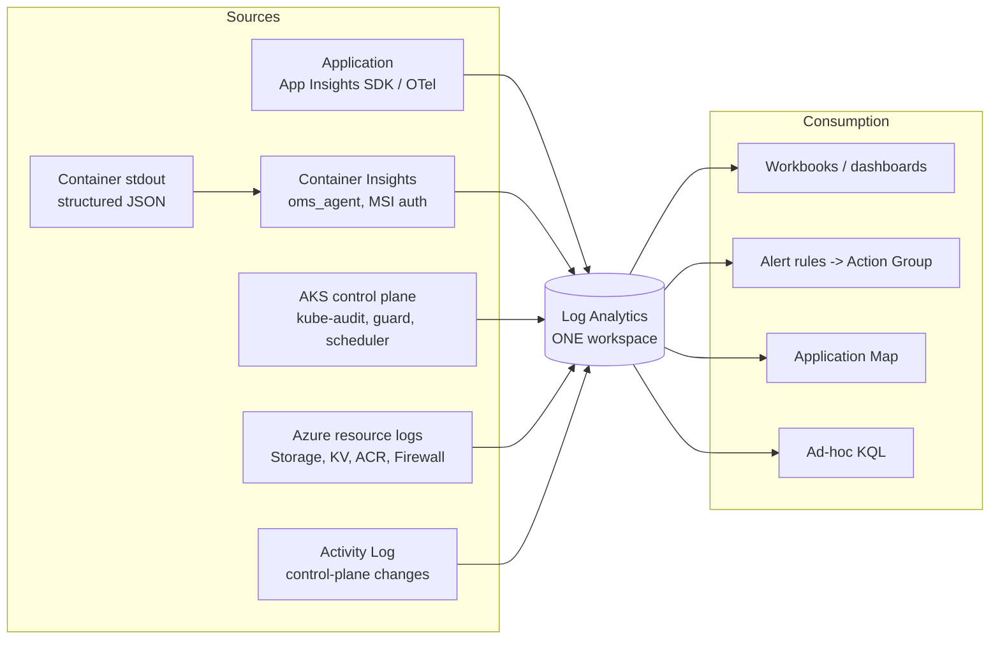

# 07 — Observability

> Part 6 of the assessment, plus the operational half of Part 4. Two explicit questions:
> *"Define the minimum dashboards/alerts you would create"* and *"Document what an operator should check
> first during an incident and how logs correlate."*
>
> **The framing that separates a senior answer from an average one:** average answers list metrics.
> Senior answers start from **user-visible impact**, define SLOs, and derive alerts from error budget
> burn. Then everything else is a dashboard you consult *during* an investigation — not something that
> pages a human.

---

## 1. The telemetry model



**The single most important design decision here is "one workspace".**

> "Everything — application traces, container stdout, the Kubernetes audit log, Storage data-plane logs,
> firewall flows and the Activity Log — lands in one Log Analytics workspace. That is what makes
> cross-layer correlation possible with a single KQL query. Splitting telemetry across workspaces to save
> on ingestion is the decision teams most regret at 3am, when the question is 'did the pod's 403 coincide
> with a role assignment change?' and the answer requires a join they can no longer perform.
>
> The counter-argument is real: one workspace means one RBAC boundary and one cost centre. In a large
> estate you'd use a shared platform workspace with **resource-context RBAC**, so teams see only their own
> resources' logs while central SRE can query across everything. That's the pattern I'd scale to."

### Private access model — and this is an explicit assessment ask

| Path | Setting | Effect |
|---|---|---|
| Ingestion | AMPLS `ingestion_access_mode = "PrivateOnly"` + `internet_ingestion_enabled = false` | Telemetry never leaves the VNet on the way in |
| Query | `query_access_mode = "Open"` when `allow_public_query = true` | Engineers can investigate from a laptop, over Conditional-Access-protected Entra auth |
| Auth | `local_authentication_enabled = false` | Entra-only ingestion — no instrumentation key can inject telemetry |

> **The deliberate compromise, worth stating as one:** *"Private ingestion, public query. Ingestion is
> where the sensitive data flows, so it stays inside the network. Query is where the humans are, and
> requiring engineers to be on the corporate network to look at logs during an incident is a real
> availability cost with limited security benefit — the access is already gated by Entra and Conditional
> Access. I made it a variable so the risk owner decides rather than me."*

🔴 **P1-1:** `internet_ingestion_enabled = var.enable_private_link` is inverted, so the code currently
does the opposite of the paragraph above. Fix it, or lead with it.

**The AMPLS trap to know:** `PrivateOnly` is global in effect. Once a VNet resolves Azure Monitor through
an AMPLS private endpoint, *all* Azure Monitor resources it reaches are subject to that scope's access
mode — **so one AMPLS in `PrivateOnly` can silently cut off another team's workspace** that shares the
same private DNS zones. This is the most common AMPLS incident and it's worth naming unprompted.

---

## 2. SLOs first, alerts second

> "I'd start by agreeing what 'working' means, because otherwise every alert threshold is arbitrary."

| SLI | SLO | Error budget (30 days) |
|---|---|---|
| Availability — `GET /api/shows` returns 2xx | 99.9% | ~43 minutes |
| Latency — p95 end-to-end | < 500 ms | 5% of requests may exceed |
| Latency — p99 | < 2 s | 1% |
| Freshness — cache age at serve time | < 2× configured TTL | — |

**Then alert on error-budget burn rate, not on raw thresholds.**

| Burn rate | Meaning | Action |
|---|---|---|
| **14.4×** over 1 hour | 2% of the monthly budget consumed in an hour | **Page.** At this rate the budget is gone in ~2 days |
| **6×** over 6 hours | Sustained degradation | **Page** (lower urgency) |
| **1×** over 3 days | Slow burn | **Ticket**, business hours |

> "Multi-window, multi-burn-rate alerting is what stops the two classic failure modes: a static threshold
> that pages on a 30-second blip nobody noticed, and a static threshold that *doesn't* page on a 2% error
> rate that quietly eats the entire monthly budget over a week. It's from the Google SRE workbook and it's
> the single biggest improvement most teams can make to their alerting."

---

## 3. The minimum alert set

Mapped directly onto the categories the assessment names.

### Page a human (Sev 1–2)

| # | Alert | Signal | Threshold | Why it pages |
|---|---|---|---|---|
| 1 | **API availability** | `AppRequests` success rate | < 99.5% over 5 min, or burn-rate 14.4× | Direct user impact |
| 2 | **Total outage** | Ready replicas | `= 0` for 2 min | Nothing is serving |
| 3 | **Latency** | `AppRequests` p95 | > 1 s for 10 min | Users feel the tail, not the mean |
| 4 | **Failed requests** | 5xx rate | > 1% over 5 min | Explicit assessment ask |
| 5 | **Pod health** | `KubePodInventory` restarts | > 3 in 15 min, or CrashLoopBackOff | Explicit assessment ask |
| 6 | **OOMKilled** | Pod `lastState.reason` | Any occurrence | Distinct from a crash — the limit is wrong, or there's a leak |
| 7 | **Image pulls** | `KubeEvents` | Any `ImagePullBackOff` / `ErrImagePull` | Explicit ask. Always actionable, never a false positive |
| 8 | **Storage access** | `StorageBlobLogs` 403 | **Any** occurrence | Explicit ask. In a healthy system this is exactly zero |
| 9 | **Auth failures** | `AADSTS7002x` in logs; KV `SecretGet` denied | Any occurrence | Explicit ask. Workload Identity has broken, or someone is probing |
| 10 | **Node pressure** | `MemoryPressure` / `DiskPressure` / `NotReady` | > 5 min | Evictions imminent |

### Ticket, don't page (Sev 3–4)

| Alert | Threshold | Why not a page |
|---|---|---|
| Cache write failures | > 5 in 15 min | The app deliberately swallows these, so without an alert they're invisible — **but they degrade freshness, not availability** |
| Firewall denies from the spoke | Any spike above baseline | Either an undeclared app change or a compromise. Investigate, don't wake someone |
| TVMaze upstream errors | > 10% over 15 min | The cache absorbs it; only pages if availability also drops |
| HPA at `maxReplicas` | > 30 min | Capacity ceiling reached — plan, don't panic |
| Certificate / secret expiry | < 30 days | Predictable; schedule it |
| Log ingestion anomaly | ±50% vs baseline | A sudden drop can mean telemetry broke — **and that's an incident hiding as a quiet dashboard** |
| Cost anomaly | Daily spend > 150% baseline | Cryptomining is a real AKS attack |

### Security alerts (route to SecOps, not to on-call)

- Activity Log: any change to `publicNetworkAccess` or a network ACL.
- Activity Log: any role assignment creation at subscription or resource-group scope.
- Key Vault: `SecretGet` by an unexpected principal.
- `kube-audit`: `exec` into a production pod; any `create` on `clusterrolebindings`.

> "Point 8 is the one worth dwelling on. **Any** Storage 403 is an alert, not a rate. In a correctly
> functioning system the count is exactly zero — the app has a role assignment or it doesn't. So a single
> 403 means either RBAC has been changed, the federated credential has broken, or someone is probing.
> Alerting on 'more than N per minute' would have hidden exactly the failure this platform is most likely
> to have."

---

## 4. Dashboards — one workbook, four sections

| Section | Panels | The question it answers |
|---|---|---|
| **1. Golden signals** | Request rate; error rate by status; p50/p95/p99 latency; availability vs SLO with error budget remaining | *Are users affected right now?* |
| **2. Cluster health** | Node Ready/NotReady by zone; pod phase distribution; restart counts; CPU/memory request vs limit vs actual; HPA current vs desired; PDB status | *Is the platform healthy?* |
| **3. Dependencies** | Blob latency + error rate; TVMaze latency + error rate; **cache hit ratio**; cache age distribution | *Which dependency is the problem?* |
| **4. Change timeline** | Helm revisions overlaid on the error-rate chart; Activity Log entries; pipeline run outcomes | *What changed?* |

**Section 4 is the one most teams don't build and the one that resolves incidents fastest.** The first
question in every incident is "what changed?", and having deploys drawn on the same time axis as the
error rate answers it visually in two seconds.

**Cache hit ratio deserves special mention** — it is the single most informative business metric here. A
sudden drop to zero means the cache is broken (RBAC, DNS, or the container). A gradual decline means the
TTL is wrong for the traffic pattern. And it directly predicts your TVMaze load and therefore your
exposure to an upstream outage.

---

## 5. Incident response — the first five minutes

**Print this. It's your answer to "what does an operator check first?"**

```
0-60s   IS IT REAL?
        - Look at the availability metric, then actually curl the endpoint.
        - "The alert fired" and "users are affected" are not the same thing.
        - If synthetic and real traffic disagree, suspect the monitoring first.

60-120s WHAT CHANGED?
        helm history banking-application -n banking-api --max 10
        az monitor activity-log list -g rg-prod-iac --start-time <1h ago> -o table
        - Most incidents are caused by a change in the preceding hour.
        - If a deploy landed just before the alert: strong candidate. Consider rollback NOW,
          diagnose after. Restoring service beats understanding it.

120-180s HOW BAD, AND HOW WIDE?
        kubectl -n banking-api get pods -o wide
        - All pods or one? One zone or all? One node or many?
        - All pods failing identically => shared dependency or config.
        - One pod failing => that pod, that node, or a scheduling issue.

180-300s WHICH LAYER?
        curl /healthz  -> is the process alive?
        curl /readyz   -> which dependency does it say is broken?
        - The readiness endpoint is designed to answer this. Trust it first.
        - Then follow the runbook for that layer: 05-troubleshooting-runbook.md
```

### Then: declare, communicate, mitigate, diagnose — in that order

> "The instinct under pressure is to diagnose first because it's the interesting part. **Mitigate first.**
> Roll back, scale out, fail over — restore the user experience, then work out why. The exception is when
> mitigation would destroy the evidence, in which case capture it first — which is why my pipeline's
> failure step dumps pod state, describes, logs and events *before* it rolls back. Thirty seconds of
> evidence capture saves a post-mortem that concludes 'root cause unknown'."

---

## 6. Log correlation — the KQL that matters

### The join keys

| Key | Links |
|---|---|
| **`operation_Id`** | App Insights request ↔ its dependency calls ↔ traces ↔ exceptions. **The primary key** |
| **Pod name** | `AppRequests.cloud_RoleInstance` ↔ `ContainerLogV2.PodName` ↔ `KubePodInventory` ↔ `KubeEvents` |
| **`cloud_RoleName`** | Service identity across all App Insights tables |
| **Time + `_ResourceId`** | Azure resource logs (`StorageBlobLogs`, `AzureDiagnostics`) to everything else |
| **`RequesterObjectId`** | `StorageBlobLogs` ↔ the managed identity's principal ID |

### Query 1 — Golden signals

```kusto
AppRequests
| where TimeGenerated > ago(1h) and Name contains "/api/shows"
| summarize
    total      = count(),
    failed     = countif(Success == false),
    p50        = percentile(DurationMs, 50),
    p95        = percentile(DurationMs, 95),
    p99        = percentile(DurationMs, 99)
  by bin(TimeGenerated, 1m)
| extend availability = round(100.0 * (total - failed) / total, 3)
| render timechart
```

### Query 2 — Follow one failing request across every layer

**This is the query to show them. It demonstrates the entire value of a single workspace.**

```kusto
let badRequest =
    AppRequests
    | where TimeGenerated > ago(1h) and Success == false
    | top 1 by TimeGenerated desc
    | project OperationId = operation_Id, Pod = cloud_RoleInstance, T = TimeGenerated;
//
// 1. What did the application say?
AppDependencies
| where operation_Id in ((badRequest | project OperationId))
| project TimeGenerated, Layer = "app-dependency", Target, Name,
          Detail = strcat(ResultCode, " ", DurationMs, "ms")
| union (
    // 2. What did the container log?
    ContainerLogV2
    | where PodName in ((badRequest | project Pod))
      and TimeGenerated between ((toscalar(badRequest | project T) - 30s) .. 30s)
    | project TimeGenerated, Layer = "container-stdout", Target = PodName,
              Name = "stdout", Detail = LogMessage
)
| union (
    // 3. What did Azure Storage actually decide, and for WHICH principal?
    StorageBlobLogs
    | where TimeGenerated between ((toscalar(badRequest | project T) - 30s) .. 30s)
      and StatusCode >= 400
    | project TimeGenerated, Layer = "azure-storage", Target = Uri,
              Name = OperationName,
              Detail = strcat(StatusCode, " ", StatusText, " principal=", RequesterObjectId)
)
| union (
    // 4. Did Kubernetes have anything to say?
    KubeEvents
    | where TimeGenerated between ((toscalar(badRequest | project T) - 2m) .. 2m)
    | project TimeGenerated, Layer = "k8s-event", Target = Name,
              Name = Reason, Detail = Message
)
| order by TimeGenerated asc
```

> **How to present this:** *"That single query takes one failing user request and lays out, in time order,
> what the app tried to do, what the container printed, what Azure Storage actually decided and for which
> principal, and what Kubernetes was doing at the same moment. In a split-workspace setup that's four
> separate investigations and a spreadsheet. Here it's one query and about ninety seconds. That's why
> 'one workspace' is a design decision and not an accident."*

### Query 3 — Cache effectiveness

```kusto
AppRequests
| where TimeGenerated > ago(6h) and Name contains "/api/shows"
| extend cache = tostring(Properties["X-Cache"])
| summarize hits = countif(cache == "HIT"), total = count() by bin(TimeGenerated, 5m)
| extend hitRatio = round(100.0 * hits / total, 1)
| render timechart
```

### Query 4 — Workload Identity failures

```kusto
ContainerLogV2
| where TimeGenerated > ago(24h)
| where LogMessage has_any ("AADSTS70021", "AADSTS700016", "AADSTS700213",
                            "AuthorizationPermissionMismatch")
| extend code = extract(@"(AADSTS\d+)", 1, LogMessage)
| summarize count(), any(LogMessage) by code, PodName, bin(TimeGenerated, 5m)
```

### Query 5 — Egress control effectiveness (the security-relevant one)

```kusto
AZFWApplicationRule
| where TimeGenerated > ago(24h) and Action == "Deny"
| summarize attempts = count() by Fqdn, SourceIp
| order by attempts desc
| take 50
```

> "This is the query that turns the firewall from a connectivity component into a **detection control**.
> A denied FQDN nobody expected is either an undeclared application change or a compromised container
> phoning home — and either way I want to know. It's the concrete payoff for choosing Azure Firewall over
> a NAT Gateway."

### Query 6 — Deployment correlation

```kusto
KubeEvents
| where TimeGenerated > ago(24h) and Reason in ("ScalingReplicaSet", "SuccessfulCreate", "Killing")
| where Namespace == "banking-api"
| project TimeGenerated, Reason, Message
| join kind=leftouter (
    AppRequests
    | where TimeGenerated > ago(24h)
    | summarize errorRate = 100.0 * countif(Success == false) / count() by bin(TimeGenerated, 5m)
) on $left.TimeGenerated == $right.TimeGenerated
| render timechart
```

---

## 7. Application instrumentation — what the app must emit

Even though the app isn't written (P0-1), the observability contract is a design decision. Own it.

| Requirement | Why |
|---|---|
| **Structured JSON to stdout** | Container Insights ingests stdout; JSON is queryable in KQL without brittle regex parsing |
| **Correlation ID propagated** (W3C `traceparent`) | Ties a request to its dependency calls — the `operation_Id` join key |
| **App Insights SDK / OpenTelemetry with the Azure Monitor exporter** | Gives you `AppRequests`, `AppDependencies` and the Application Map for free |
| **Custom dimension `X-Cache`** on each request | Makes the cache hit ratio a first-class metric |
| **Never log tokens, blob contents, or full request bodies** | The logs are less protected than the data |
| **Log at `info` in prod, `debug` in non-prod** | Your values overlays do exactly this — good |
| **Explicit dependency spans for Blob and TVMaze** | So you can attribute latency to the right dependency instead of guessing |
| **Emit on graceful shutdown** | Otherwise the last thing before a pod dies is silence, which is the least useful log |

> "The single highest-value instrumentation decision is **separate dependency spans for Blob and
> TVMaze**. Without them, 'the API is slow' is a dead end. With them, the Application Map immediately shows
> which of the two is responsible, and the fix for each is entirely different — one is a private endpoint
> or RBAC problem, the other is a firewall or upstream problem."

---

## 8. What's missing today, and what I'd add

| Gap | Fix | Value |
|---|---|---|
| Only one alert rule exists in code (`failed_requests`) | Codify the full alert set as `azurerm_monitor_scheduled_query_rules_alert_v2` | Alerts should be IaC like everything else — reviewable, versioned, environment-parameterised |
| No dashboards in code | `azurerm_application_insights_workbook` | Same reasoning |
| No synthetic monitoring | An availability test, or a CronJob hitting `/api/shows` from inside the cluster | **Catches outages during zero traffic.** Real traffic can't tell you the API is broken at 4am |
| No distributed tracing | OpenTelemetry + Azure Monitor exporter | Attribute latency to Blob vs TVMaze vs the app |
| No Prometheus metrics | Azure Monitor managed Prometheus + Managed Grafana | Better for high-cardinality Kubernetes metrics; KEDA can scale on them |
| `sampling_percentage = 100` | Adaptive sampling with a **fixed 100% floor on failures and exceptions** | Controls cost without ever losing the traces you actually need |
| No cost alerting | Budget alerts + anomaly detection | Cryptomining in a compromised cluster shows up on the bill before it shows up anywhere else |
| No log export/archive | Immutable export to a locked storage account | Regulatory retention, and audit evidence that survives an attacker with subscription access |
| No alert routing by severity | Action groups per severity, integrated with PagerDuty/ServiceNow | Sev-1 pages; Sev-3 raises a ticket. Everything paging is how alerts get ignored |

---

## 9. The two sentences to land

> **On design:** *"One workspace, everything in it, correlated by `operation_Id`. That's what turns four
> separate investigations into one query — and during an incident, time to correlate is time to
> recovery."*
>
> **On alerting:** *"I alert on user-visible impact and error-budget burn, not on every metric that has a
> threshold. Everything else is a dashboard I look at once I've been paged. The failure mode I'm designing
> against isn't missing an alert — it's a team that has learned to ignore them."*
